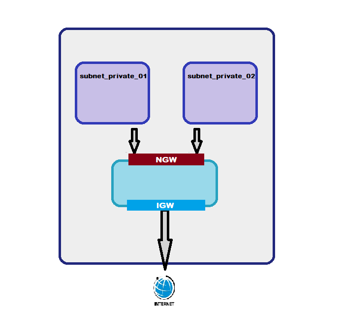

## 1. Project Overview

1.1 Project code on a Containerized [NodeJS, Express, Swagger] API for a MySQL Database.
1.2 Containerized using Docker/Docker-Compose and Deploy to a OpenShift PaaS/Cloud k8s cluster using Terraform/Ansible IaC. 

## 2. IaC Provisioning

Provision an AWS VPC using [Terraform](https://www.terraform.io/) scripts. This would create a VPC, 2 private subnets, 1 public subnet, 1 private security group, and 1 public security group. The layout of this looks like following:



### 2,1 Module Breakdown

The scripts in this project have been broken down into four modules
- vpc:
    - input: vpc info from variables
    - output: vpc id
- private subnet:
    - input: vpc id from vpc module
    - output: subnet id
- public subnet:
    - input: vpc id from vpc module
    - output: subnet id
- security group
    - input: private and public subnet id's from respective modules
    - output: private and public security group id's

### 2.2 Executing the scripts

- Install terraform
- Switch to the IaC directory
- Run `terraform init` to initialize the modules and provider
- Export AWS account keys

```
$ export AWS_ACCESS_KEY_ID=myawsaccesskeyid
$ export AWS_SECRET_ACCESS_KEY=myawsecretaccesskey
```
- Run `terraform plan` to dry-run the scripts for compatibility
- Run `terraform apply`

```
$ export TF_VAR_vpc_name=my_vpc_name
$ terraform plan
$ terraform apply
... 
```

## 3. Build Image & Pushing to Repository

### 3.1 Build the images 

```
docker image build -t db -f .\Dockerfile-mysql .
docker image build -t app -f .\Dockerfile-app .
```
### 3.2 Test the images for functionality over http://localhost:3000

#### 3.2.1 Create the containers

```
docker container run -idt  -p 3000:3000 --name app app
docker container run -idt -p 3306:3306 --name db -e MYSQL_ROOT_PASSWORD=bobby -e MYSQL_USER=root -e MYSQL_PASSWORD=bobby db
```

#### 3.2.2 Check API Functionality from app container or MySQL Workbench

Use the following Creds & Configs to connect to the titanic database 
```
- Hostname      => 127.0.0.1
- Port          => 3306
- Username      => root
- Password      => bobby [secured later using Docker secrets/k8s secrets/OCP secrets feature]
- Default Schema=> titanic
```

### 3.3 Tag and push the image to DockerHub / Private Repository [Nexus/Artifactory] 

#### API App Image
```
docker image tag app bobbybabu007/titanic-api:latest
docker push bobbybabu007/titanic-api:latest
```
#### MySQL DB Image
```
docker image tag db bobbybabu007/titanic-mysql:latest
docker push bobbybabu007/titanic-mysql:latest
```

## 4. Building an NPMStatics Multibranch Pipeline on JenkinsCI in k8s/OCP Cluster [In progress]

Using Jenkinsci helm charts, create a Jenkins pipeline on the provisioned cluster


## 5. Realise the Fullstack over k8s using AWS Elastic Kubernetes Service

### 5.1 Terraform IaC Scripting: 
In progress 

### 5.2 Helm Chart Configuration: 
In Progress

## 6. Realise the Fullstack over k8s using AWS OpenShift PaaS 

### 6.1 Terraform IaC Scripting: 
Incomplete 

### 6.2 OpenShift Config Maps: 
Incomplete 
